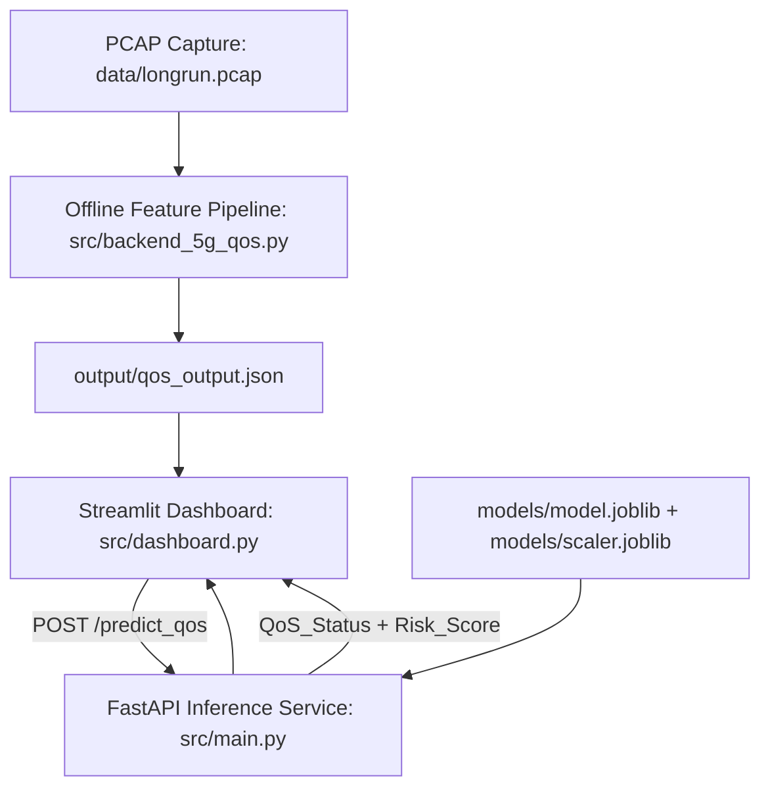
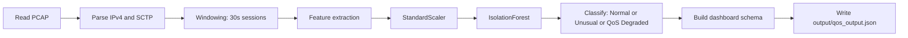
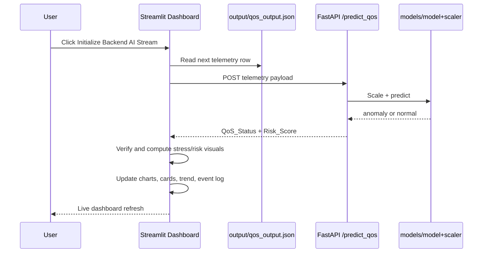

# 5G QoS AI Monitor - System Architecture and Workflow

## 1. System Architecture

### Components

1. Data preparation layer
- `src/backend_5g_qos.py` reads PCAP, extracts 30-second windows, computes features, runs Isolation Forest, and writes `output/qos_output.json`.

2. Inference service layer
- `src/main.py` starts FastAPI.
- Loads `models/model.joblib` and `models/scaler.joblib`.
- Exposes `/predict_qos` endpoint.

3. Presentation layer
- `src/dashboard.py` (Streamlit) renders telemetry cards, charts, risk trend, event log, and KPI summary.

4. Artifact layer
- `output/qos_output.json` stores session-wise telemetry, summary, and alerts.
- `models/model.joblib` and `models/scaler.joblib` are trained ML artifacts used by FastAPI.

## 2. Data Pipeline (PCAP to JSON)

### Offline pipeline steps

1. Read packets from PCAP.
2. Parse network fields and infer application type from SCTP ports.
3. Group packets into 30-second windows.
4. Compute features such as:
- `Latency_ms`
- `Signal_Strength_dBm` (proxy)
- `BW_Gap`
- `Resource_Allocation_pct`
- `loss_rate`
- `Anomaly_Score`
5. Run Isolation Forest and assign QoS class.
6. Export in dashboard-compatible JSON format.

## 3. Runtime Workflow (Dashboard Loop)

### Online loop steps in `src/dashboard.py`

1. Load initial streams from `output/qos_output.json` (primary) and optional PCAP-derived stream (fallback/enrichment).
2. Wait for user to click the initialize button.
3. For each iteration:
- Get next telemetry row.
- Build request payload.
- Send payload to FastAPI `/predict_qos`.
- Receive `Risk_Score` and `QoS_Status`.
- Apply dashboard verification logic with JSON QoS tag.
- Compute stress level and map to status bands.
- Update all UI sections (telemetry, QoS signals, context, AI analytics, KPIs).
4. Sleep ~1 second and repeat.

## 4. Risk Decision Path (Current Implementation)

1. FastAPI model output (`src/main.py`)
- IsolationForest predicts anomaly or normal.
- Hard threshold gate converts to binary `Risk_Score`.

2. Dashboard verification (`src/dashboard.py`)
- If source JSON tag is `degraded`, dashboard forces risk to 1.
- If source JSON tag is `normal`, dashboard forces risk to 0.
- Otherwise, it uses backend model risk.

3. Final UI status
- Dashboard computes stress percent and displays status bands like NOMINAL, WARNING, HIGH RISK, or CRITICAL.

## 5. End-to-End Operation Summary

1. Generate `output/qos_output.json` from PCAP using `src/backend_5g_qos.py`.
2. Start FastAPI using `scripts/run_backend.sh` or `uvicorn` with `--app-dir .`.
3. Start Streamlit dashboard via `streamlit run src/dashboard.py`.
4. Click initialize to begin live inference and visualization loop.
5. Monitor real-time telemetry, risk trend, and QoS events.
